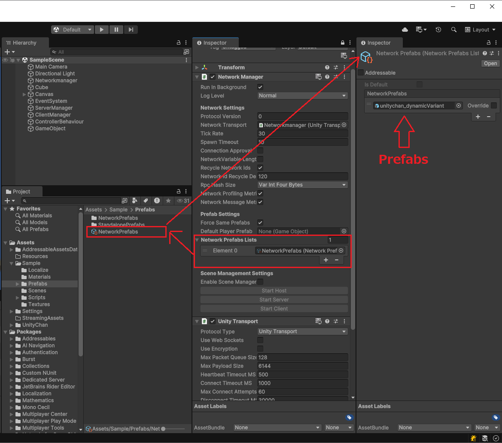
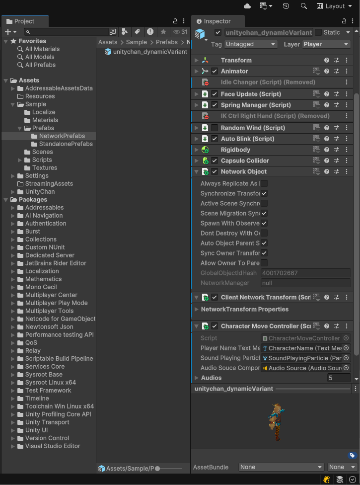

# NetcodeForGameObjects_UnitychanSample
Netcode for GameObjectsのユニティちゃんサンプルです。
対応するUnityバージョンは、Unity6です。

[English](README.md)


# 画面


# 大まかな流れ
大きく3つの接続方法があります。<br />
ローカルネットワークで直接つなぐパターン、Relayサーバー経由でつなぐパターン、ヘッドレスサーバーでつなぐパターン です。<br />


## ローカルネットワークで繋ぐ場合
1.誰かが「ホストとして起動」として起動します。 <br />
2.ホストとして起動したら、右上画面に ホストのIPアドレス、Port番号が載ります。<br />
3.クライアントとして繋ぎに行く人は、「接続先IPアドレス、Port番号」を入力して、「クライアントとして起動」を押します。<br />

 <br />
※「Relayサーバー使用」のチェックボックスは外してください

## Relayサーバーを経由して繋ぐ場合

こちらのつなぎ方を行う場合は、UnityのRelayサービスを利用します。<br />
<br />
Unityプロジェクトをクラウドサービスと紐付け、ダッシュボード上でRelayをOnにした状態でビルドする必要があります。

1.誰かが「Relayサーバー使用」をチェックした状態でホストとして起動します<br />
2.ホストとして起動したら右上画面に、参加用のコードが表示されます。<br />
3.クライアントとしてつなぎに行く人は、「Relayサーバー使用」をチェックした状態で、RelayCodeにホスト側のコードを入力します。<br />
 <br />

## ヘッドレスサーバーを利用して繋ぐ場合

こちらのつなぎ方を行う場合は、Server Buildをしたファイルが必要です。<br />
 <br />
Build Profileで「Windows Server」もしくは「Linux Server」、「MacOS Server」でビルドしてください。

1.サーバーのIPアドレス、及びポート番号を入力して、「クライアントとして起動」を押すことで実行可能です。

# 操作方法について
カーソルキーで移動し、キーボードの1～5を押す事でボイス再生が出来ます。<br />
スマートフォンではバーチャルパッドを実装していますので、スマートフォン向けビルドで操作できます。<br />

# ダミークライアントモードについて
Define「ENABLE_AUTO_CLIENT」をProjectSettingsより有効にする必要があります。<br />
「Sample.exe -batchmode」というようにバッチモードで起動した際にはダミークライアントとして動作します。<br />
実行ファイルと同じディレクトリにあるconnectInfo.json を読みこんで、その設定で接続します。接続先等を弄りたい場合はコチラを直接編集して起動してください。<br />


# クイックスタート
ネットコードの基礎や、このサンプルプロジェクトでの利用方法を簡単に説明します。

## Relayではなく、直接ネットワークを繋ぐ方法
以下のようにNetworkManagerクラスを設置します。<br />

 <br />
NetworkManagerがネットワーク周りの管理を行います。
NetworkManagerに設定されたUnityTransportが実際の通信を行います。

### Hostとして起動する
Hostはサーバーとクライアントの両方を一つのプロセスで担う状況です。<br />
ゲーム進行をするサーバーと、プレイするためのクライアントが同時に動くことになります。<br />

Hostでは、どのPortでサーバーを起動するのか？どのようなIPアドレスから接続を受け付けるのか？といったことをUnityTransportに設定します。<br />
以下のようなコードになります。<br />
```
// NetworkManagerから通信実体のTransportを取得します
var transport = Unity.Netcode.NetworkManager.Singleton.NetworkConfig.NetworkTransport;
var unityTransport = transport as UnityTransport;

// どのIPアドレスから設けて、7777ポートで待ちます
unityTransport.SetConnectionData( IPAddress.Any.ToString() , (ushort)7777 );
```

設定が完了したら、Hostとして起動します。
```
Unity.Netcode.NetworkManager.Singleton.StartHost();
```
と呼び出すことでHostとして起動するようになります。<br />


### Clientとして起動する
クライアントとして起動する場合、接続先とポートを指定する必要があります。<br />
これもUnityTransportから設定します。<br />
以下のようなコードとなります。

```
// NetworkManagerから通信実体のTransportを取得します
var transport = Unity.Netcode.NetworkManager.Singleton.NetworkConfig.NetworkTransport;
var unityTransport = transport as UnityTransport;

// IPアドレス 192.168.11.32のポート7777に接続しに行きます。
unityTransport.SetConnectionData( "192.168.11.32" , (ushort)7777 );
```

設定が完了したらClientとして起動します
```
Unity.Netcode.NetworkManager.Singleton.StartClient();
```
と呼び出すことでHostとして起動するようになります。


## Networkで同期したいPrefabをNetworkPrefabListに登録

まず初めに、以下の画像のようにネットワークで同期させたいPrefabをNetworkPrefabListに登録します。
 <br />

### NetworkObjectコンポーネント
同期させたいPrefabにはNetworkObjectComponentを付ける必要があります。<br />
 <br />


### NetworkBehaviourを継承したクラス
また同期したい情報を持つComponenntはNetworkBehaviourを継承する必要があります。<br />
そうすることで NetworkVariableというネットワーク上で同期する変数、RPCという接続先で実行させるための関数の機能を利用することが出来ます。

## Network上にObjectをSpawnさせる
PrefabをInstantiateしたあとに、NetowkObjectのSpawnをすることで、ネットワーク上にオブジェクトを作ることが出来ます。<br />
本サンプルでは、各クライアントがオーナーとして操作キャラクターをSpawnするようにしています。<br />
本サンプルでは以下のようなコードによって実現しています。
```
var gmo = GameObject.Instantiate(prefab, randomPosition, Quaternion.identity);
var netObject = gmo.GetComponent<NetworkObject>();
netObject.SpawnWithOwnership(clientId);
```

## このサンプルでの同期について

このサンプルでは、CharacterMoveController・ClientNetworkTransformのみが、ネットワーク同期するためのコンポーネントです。

### Transformの同期
Unityの標準に用意されているNetworkTransformはサーバー側の座標を正解としています。<br />
そのため、手元では座標操作などを行えずサーバー側で座標更新します。<br />
そうすると、通信が遅延すると、手元のキャラクターを快適に動かすことが困難となります。<br />

そのため、サーバーではなく手元のユーザーが直接操作するという形を取るために以下のような処理を持つClientNetworkTransformを利用しています。

```
public class ClientNetworkTransform : NetworkTransform{
    protected override bool OnIsServerAuthoritative(){
        return false;
    }
}
```

### NetworkVariableによる同期
このアプリでは、Animatorに流すSpeed変数とPlayer名の同期にNetworkVariableを利用しています。

オブジェクトのオーナーが操作することを前提にしていますので、以下のように宣言しています。
```
private NetworkVariable<Unity.Collections.FixedString64Bytes> playerName = 
            new NetworkVariable<Unity.Collections.FixedString64Bytes>("",NetworkVariableReadPermission.Everyone,NetworkVariableWritePermission.Owner);

```

そして、以下のようにすることでオーナーのみが更新する形を取っています。( IsOwnerはNetworkBehaviour側にあるプロパティです )
```
private void Start(){
    if (IsOwner){
        this.playerName.Value = ConfigureConnectionBehaviour.playerName;
    }
}
```

### RPCによる処理
RPCはリモートプロシージャルコールの略で、遠隔での関数呼び出しのことです。<br />
本サンプルでは、1～5キーを押したときにキャラクターが音声再生することに利用しています。<br />

宣言方法はとても楽で、以下のように [Rpc]属性を付けます。<br />
そして、呼び出した時に誰が実行したいかを引数で渡します。ここでは全員実行してほしいので、 "SendTo.Everyone" としています。
```
[Rpc(SendTo.Everyone)]
private void PlayAudioRpc(int idx) { 
    this.audioSouceComponent.Play();
}
```

そして、以下のようにすることで、すべてのクライアントでPlayAudioRpcが実行される形となっています。
```
if(IsOwner){
  PlayAudioRpc(0);
}
```
