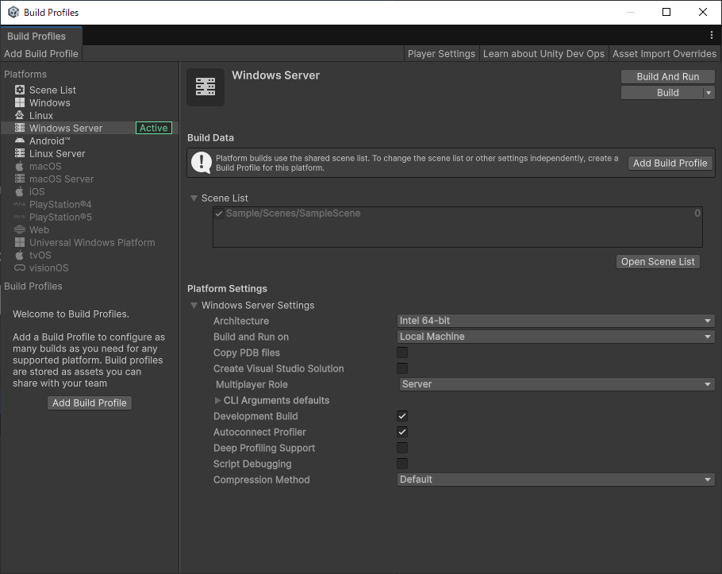

# NetcodeForGameObjects_UnitychanSample
Netcode for GameObjectsのユニティちゃんサンプルです
[日本語はコチラ](README.ja.md)

# 画面

# 大まかな流れ
大きく3つの接続方法があります。 
ローカルネットワークで直接つなぐパターン、Relayサーバー経由でつなぐパターン、ヘッドレスサーバーでつなぐパターン です。 

## ローカルネットワークで繋ぐ場合
1.誰かが「ホストとして起動」として起動します。  
2.ホストとして起動したら、右上画面に ホストのIPアドレス、Port番号が載ります。 
3.クライアントとして繋ぎに行く人は、「接続先IPアドレス、Port番号」を入力して、「クライアントとして起動」を押します。 

  
※「Relayサーバー使用」のチェックボックスは外してください

## Relayサーバーを経由して繋ぐ場合

こちらのつなぎ方を行う場合は、UnityのRelayサービスを利用します。 
 
Unityプロジェクトをクラウドサービスと紐付け、ダッシュボード上でRelayをOnにした状態でビルドする必要があります。

1.誰かが「Relayサーバー使用」をチェックした状態でホストとして起動します 
2.ホストとして起動したら右上画面に、参加用のコードが表示されます。 
3.クライアントとしてつなぎに行く人は、「Relayサーバー使用」をチェックした状態で、RelayCodeにホスト側のコードを入力します。 
  

## ヘッドレスサーバーを利用して繋ぐ場合

こちらのつなぎ方を行う場合は、Server Buildをしたファイルが必要です。 
  
上記のサーバービルドを行ったファイルをサーバーに置き、実行することで動作出来ます。

1.サーバーのIPアドレス、及びポート番号を入力して、「クライアントとして起動」を押すことで実行可能です。

# 操作方法について
カーソルキーで移動し、キーボードの1～5を押す事でボイス再生が出来ます。 
スマートフォンではバーチャルパッドを実装していますので、スマートフォン向けビルドで操作できます。 

# ダミークライアントモードについて

「Sample.exe -batchmode」というようにバッチモードで起動した際にはダミークライアントとして動作します。 
実行ファイルと同じディレクトリにあるconnectInfo.json を読みこんで、その設定で接続します。接続先等を弄りたい場合はコチラを直接編集して起動してください。 

